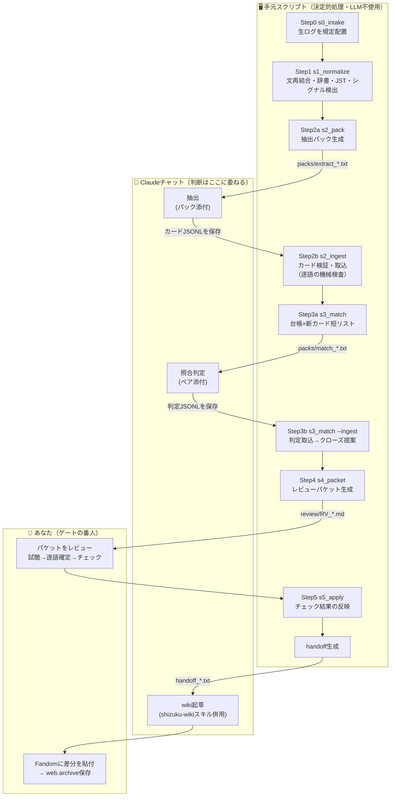

# しずくwiki ログ処理パイプライン — 操作マニュアル（モデルA：手動運転版）

紹介ページと年表ページを、蓄積するログ（配信の字幕/チャット/概要欄/事後コメント、Xログ）から
**人間の承認を通してだけ** 更新するための道具一式です。
完全自動化はしません。各ステップをあなたが実行し、出力を目で確かめながら進めます。
このフォルダは **あなたの実データ（配信4本＋Xログ2641件）を一巡処理した状態** で納品されているので、
まず「できあがった中間物を眺めて検証する」ところから始められます。

---

## 0. 全体像



テキスト版（同じ流れ）:

```
生ログ ─Step0→ raw/ ─Step1→ normalized/(文・チャット・シグナル)
  normalized ─Step2a→ 抽出パック ─(Claudeに添付)→ カードJSONL ─Step2b→ cards/ ＋ ledger/open
  cards×open ─Step3a→ 照合パック ─(Claude判定)→ 判定JSONL ─Step3b→ クローズ提案
  候補すべて ─Step4→ レビューパケット ─(あなた: 試聴・チェック)─Step5→ handoff
  handoff ─(shizuku-wikiスキル併用チャット)→ wiki差分 ─(あなた)→ Fandom貼付
```

**設計原則（前回の合意そのまま）**
1. 字幕は「索引」。逐語はあなたの耳（t付きURLの試聴）でしか確定しない。
2. 拾う基準は「重要度」でなく「型」。重要かどうかの判定は、後でリンクが成立した時まで遅延させる。
3. LLMがやるのは「新規1単位の抽出」と「短リストの照合判定」だけ。蓄積と検索はディスクとスクリプト。

**5つの人間ゲート**: ①逐語（VERIFY） ②公開（ADOPT→貼付） ③辞書・スキーマ変更 ④ループ確定（CLOSE） ⑤月次棚卸し

---

## 1. 準備

- Python 3.9 以上だけ。**追加ライブラリのインストールは不要**（全部標準ライブラリ）。
  コマンドは `python` で記載しています。環境によっては `py` や `python3` の場合があります（`python --version` で確認）。
- コマンドはすべて **このフォルダ直下で** 実行します: `cd shizuku-pipeline`
- 文字化けするときは端末で `chcp 65001`。

フォルダ構成:

```
shizuku-pipeline/
├─ MANUAL.md            ← 本書
├─ DATA-ISSUES.md       ← データ不備の対処マニュアル（doctor.pyと対）
├─ README.md
├─ scripts/             ← ステップ0〜5 + doctor
├─ prompts/             ← Claudeに渡す指示（パックに自動同梱される）
├─ config/              ← ASR補正辞書 / 語彙群 / 既知機能レジストリ
├─ examples/            ← Claude出力の見本（形式の教材・デモ再現用）
└─ data/
   ├─ raw/              ← 生ログ（コピー。絶対に編集しない）
   ├─ normalized/       ← Step1の成果物（文・チャット・シグナル・X月別）
   ├─ packs/            ← Claudeに添付するファイル（再生成可・gitに上げない）
   ├─ llm_out/          ← Claudeが返したJSONLの生データ（**再生成不可・gitに上げる**）
   ├─ cards/            ← カード庫（月別JSONL）
   ├─ ledger/           ← 台帳 open/closed/クローズ提案
   ├─ review/           ← レビューパケット・doctorレポート
   ├─ handoff/          ← wiki起草チャットへの受け渡し
   └─ state/            ← 処理済み管理（消すと再処理される）
```

**用語ミニ辞典**
- **Card Store（カード庫）** … `data/cards/YYYY-MM.jsonl` 群。抽出した全カードの保管場所で、DBではなくただのJSONLファイルです。図中の円柱「Card Store」はこれを指します。
- **カード** … ログから抽出した1単位（event / quote_candidate / open_loop / capability / profile_fact / stream_note）。
- **台帳** … 未回収の伏線（目標・願望・不能表明・予告・過去参照・定型ネタ・関係マーカー）の一覧。
- **パック** … プロンプト＋データを1ファイルにしたもの。Claudeにそのまま添付する。
- **パケット** … あなたがチェックボックスを埋めるレビュー用Markdown。
- **handoff** … 承認済み事項だけを、shizuku-wikiスキルの受け渡し形式に整形したもの。

---

## 2. ステップ別の手順

### Step 0｜取り込み

| | |
|---|---|
| 目的 | ログ置き場を**再帰探索**し、命名規則の違いを吸収して `data/raw/` にコピーする |
| コマンド | `python scripts/s0_intake.py --src <リポジトリのルート>` |
| 下見 | `--dry-run` を付けると**書き込まず**に認識結果だけ表示（初回はこれを推奨） |
| 出力 | `data/raw/streams/{日付}_{動画ID}/`（`info.txt` `chat.txt` `comments.txt` `sbv.txt`か`srt.txt` `origin.json`）、`data/raw/x/` |

#### フォルダ構造・ファイル名はどうあるべきか → **今のままで大丈夫です**

`--src` にはリポジトリのルートを丸ごと渡してください。配下を再帰的に探し、年フォルダでも配信ごとのサブフォルダでも平置きでも同じように拾います。

```
AI-VTuber-Shizuku-log/          ← ここを --src に渡す
├─ docs/                        （無視）
└─ logs/
   ├─ discord/                  （現状スキップ。将来の拡張ポイント）
   ├─ twitter(x)/               2023.txt 2024.txt 2025.txt 202601-05.txt → Xログとして取り込み
   └─ youtube/2023/, 2026/ …    配信フォルダは何階層でも、名前が何でも可
```

**判定は「ファイル名の形」ではなく中身**でしています。具体的には:

- **動画IDと日付は `info.txt` の「動画ID」「投稿日」を正とする**（最も信頼できるため）。フォルダ名やファイル名は補助にすぎません。だから `2023-01-19_(配信アーカイブ)…` のように**フォルダ名にIDが無くても**、`YuJ4oOGNGxg.info.txt` のように**ファイル名にタイトルが無くても**、どちらでも正しく解決されます。もし両者が食い違えば `info.txt` を採用し、`要確認` として警告します。
- **種別は語尾で判定**。区切り文字（`.` `_` `-`）と `ja` の有無は問いません。下表がすべて同じものとして扱われます。

| 種別 | 認識される書き方（例） |
|---|---|
| 字幕(SBV) | `.ja.sbv.txt` / `_ja_sbv.txt` / `.sbv.txt` / `.sbv` |
| 字幕(SRT/VTT) | `.ja.srt` / `.ja.srt.txt` / `_ja_srt.txt` / `.vtt` |
| チャット | `.live_chat.txt` / `_live_chat.txt` / `.chat.txt` |
| 概要 | `.info.txt` / `_info.txt` |
| 事後コメント | `.comments.txt` / `_comments.txt` |

つまり **ご質問の `ファイル名.ja.sbv.txt` はそのままで問題ありません**。`.compiled.md` や `.en.srt`（日本語以外の字幕）は自動的に無視されます。

#### 字幕はSBVでもSRTでも構いません（重要）

過去ログには **`.ja.srt` しか無い回**（例: 2023-01-23）や **`.ja.srt.txt` の回**（2023-01-28）があります。
そのため字幕パーサをSRT/VTT対応にしてあり、SBVが無ければ自動でSRTを使います（両方あればSBV優先）。
YouTube自動字幕のSRTにありがちな「前のキューを丸ごと含んだまま伸びる」ローリング重複も、差分だけ残すよう処理済みです。
どちらを使ったかは `meta.json` の `subtitle_format` と doctor のD03所見で確認できます。

#### Windowsのファイル名移行について → **戻す必要はありません。移行も止めなくて大丈夫です**

このツールは旧名・新名・移行途中の混在をすべて同時に受け付けます。移行はあなたのペースで進めてください。
新しく決めるなら、フォルダ `{日付}_{動画ID}`／ファイル `{動画ID}.{種別}.txt` の形が短く衝突しにくく扱いやすい形です（ただし**必須ではありません**）。
なお、長いタイトルをフォルダ名とファイル名の両方に持つ従来形式はパスが260文字制限に触れやすいので、Windowsで
`git config --global core.longpaths true` を有効にしておくとcloneやcheckoutで詰まりにくくなります。

✅ **検証**: まず `--dry-run` で一覧を見て、`[OK]`／`[不足]`／`字幕=sbv|srt` を確認します。実際のリポジトリ構造で検証した際の出力例:

```
[OK  ] 2023-01-19_YuJ4oOGNGxg  字幕=sbv(srtも有→sbv優先)
[OK  ] 2023-01-23_Pybth-Hn9wQ  字幕=srt
[不足] 2023-01-28_aaTbkoBjimo  字幕=srt
        ※不足: comments   元: 2023-01-28_【AI Vtuber_雑談配信】…
[OK  ] 2026-07-24_fm2mzPJylCU  字幕=sbv
```

- `[不足]` は取り込み自体は行われます（あるものだけ処理されます）。恒久的に存在しない場合もあるので、止まりません。
- Xログの `[空]`（中身が「なし」）は休眠期の正常な記録 → `DATA-ISSUES.md §6`。
- 二重コピーはされません（同一サイズならスキップ）。何度実行しても安全です。
- 各配信フォルダに `origin.json` が置かれ、**どのファイルから作られたか**を後から追跡できます。

#### データが「無い」ときの扱い（空ファイルは作らないでください）

欠落は種別ごとに重要度が違うので、表示も分けています。

| 種別 | 扱い | 理由 |
|---|---|---|
| 字幕 | **ERROR** | 無いと配信の中身が一切読めない |
| チャット | **WARN** | バースト・ミスマッチ検知の土台。無いと機能検知が弱る |
| info | **WARN** | 動画IDと日付の正の情報源 |
| コメント | **INFO**（`[OK]`のまま） | 元動画にコメントが無いのは普通のこと。パイプラインは動く |

**空ファイルを作るのは非推奨**です。「取得済みで0件」と「未取得」が区別できなくなり、後から取得漏れを追えなくなります。
代わりに、恒久的に存在しないと分かっているものだけ `config/known_absent.tsv` に理由つきで登録してください。

```
# 動画ID	種別(comments|chat|subs)	理由
qcqC3McRRX4	chat	元ライブが保存破損。記録として配信情報のみ保持
```

登録すると報告から消え、代わりに `・既知の不在: chat（known_absent.tsv に登録済み）` と表示されます。
**理由がドキュメントとして残る**のがこの方式の利点です。s0は末尾に貼り付け用の候補行も出力します（コメント欠落は既定でINFOなので、登録は任意です）。

#### チャットがOCR復元のとき（`*.live_chat_ocr.txt`）

そのままのファイル名で認識します（`live_chat_ocr.txt` / `_live_chat_ocr.txt` など）。実チャットがあればそちらを優先し、
無ければOCRを使います。ただし**OCRデータは扱いが変わります**:

- パックの冒頭に「逐語引用禁止・時刻は粗い・取りこぼしあり」という注意書きが自動で入る。
- Step 2bのingestが、OCRチャットを根拠にした `verbatim: true` を**機械的に却下**する（誤字を逐語として引用する事故を防ぐ）。
- doctorがD12として件数と時刻粒度を報告する（実測例: 367件・粒度15秒）。件数は**下限値**として読んでください（画面に映っていた分しか復元できないため）。

⚠ **ファイル名に別の動画IDを入れないでください。** 例えば `…_zZDlC3BcQ2M_SulrjdfVDV0.live_chat_ocr.txt` のように
2つ目のIDがあると、別配信のデータと誤認される危険があります。現在は「1フォルダに `info.txt` が1つなら、そのフォルダの配信のもの」
という規則で誤帰属を防ぎ、加えて `要確認` に警告を出しますが、命名は `{何でも}.live_chat_ocr.txt` に統一するのが安全です。
OCR元の動画を記録したい場合は、ファイル名ではなく**ファイル内の先頭にコメント行**として書いてください。

#### アーカイブ再アップ（投稿日 ≠ 出来事の日）

元配信が破損して後日アーカイブとして上げ直した場合、**そのまま処理すると年表の日付が間違います**。
`config/stream_relations.tsv` に関係を宣言してください。

```
# 動画ID	関係	相手の動画ID	備考
zZDlC3BcQ2M	archive_of	qcqC3McRRX4	元ライブ(2026-02-28)が保存破損したため再アップ
```

これだけで、(1) パックに「出来事が起きた日は2026-02-28」という指示が入り、(2) ingestがカードの `date_jst` を
**自動で元配信日に補正**します（元の投稿日は `upload_date` として保持）。実測の動作:

```
⚠ 1行目: アーカイブ再アップのため日付を 2026-03-03 → 2026-02-28 に補正
```

### Step 1｜正規化（決定的処理。ここにLLMは入らない）

| | |
|---|---|
| 目的 | 字幕（SBV/SRTどちらでも）の文再結合・辞書補正、チャット整形、シグナル検出、XのUTC→JST変換 |
| コマンド | `python scripts/s1_normalize.py --all`（1本だけなら `--stream <動画ID>`） |
| 出力 | `data/normalized/streams/{id}/sentences.tsv, chat.tsv, signals.json, meta.json`、`data/normalized/x/{月}.jsonl` |

検出するシグナル4種:
1. **バースト** … チャットが盛り上がった時刻（名言候補の在り処）
2. **字幕沈黙×チャット密集** … *非言語音イベント候補*。音声系の新機能は字幕に写らないので、この「影」で捕まえる
3. **事後コメントの時刻** … 視聴者による無償のハイライト注釈
4. **概要欄の新規行** … 企画・ギミックの告知（「やる気ゲージ」はこれで捕まる。字幕には0回）

✅ **検証（同梱データでの実測値。再実行して同じ数字になればOK）**
- 7-24配信: `1199ブロック→808文`（`[sbv]`表示）、辞書適用99箇所。`sentences.tsv` を開き、**asr列に「秋先生」が残り、norm列では「あき先生」になっている**こと（asr列は原文保存、norm列だけ補正、が正しい状態）。
- 8-02配信: ミスマッチ区間の先頭が `36:40〜37:20`（＝カラスの鳴き真似〜いびき化の実イベント。チャット爆発中に字幕29秒沈黙）。
- 7-24の `signals.json` → `novel_description_lines` に **やる気ゲージの行** が出ている。
- X月別: `2026-01:233 / 02:1148 / 03:773 / 04:396 / 05:91`（計2641件）。
- 4-26の `comment_timestamps` に `2:58 / 4:34 / 28:50 / 37:32`（事後コメント由来）。

⚠ つまずき: 概要欄の「新規行」検出は**日付順に処理した時だけ**正しく育ちます。最初の1本は基準線扱い（新規行なし）。

### Step 2｜抽出（Claudeに委ねる唯一の「読む」工程）

**2a. パック生成**

1本ずつでも、まとめてでも作れます。まとめて作っても**Claudeに渡すのは1つずつ**です（理由は2b）。

```
python scripts/s2_pack.py --status                 # 進捗一覧（済/未・カード枚数）
python scripts/s2_pack.py --all                    # 未抽出のもの全部を一括生成 ＋ 作業リスト作成
python scripts/s2_pack.py --stream <動画ID>         # 1本だけ
python scripts/s2_pack.py --x 2026-02              # Xログ1ヶ月だけ
python scripts/s2_pack.py --all --redo             # 抽出済みも作り直す
python scripts/s2_pack.py --all --max-chars 60000  # 分割をもっと細かく
```

`--all` は **未抽出のものだけ**を日付順に生成し、`data/packs/WORKLIST.md`（チェックボックス付きの作業リスト）を作ります。
1パックが `--max-chars`（既定9万文字）を超えると**自動で分割**されます。実測の生成例:

```
2026-04-26   66,692文字  extract_2026-04-26_BU-BxUkGjc4.txt
2026-08-02   67,327文字 part1/2  extract_2026-08-02_G1kp2SXuFc4_part1.txt
2026-08-02   69,767文字 part2/2  extract_2026-08-02_G1kp2SXuFc4_part2.txt
2026-03      54,707文字 part1/4  extract_x_2026-03_part1.txt
```

パックの中身 = 抽出プロンプト（`prompts/extract_stream.md` / `extract_x.md`）＋配信固有の注意＋シグナル＋タイムライン
（`[S 時刻] しずく発話` と `[C 時刻 ID] チャット原文` の時系列統合）。

⚠ **一括生成しても、抽出作業まで一気にやろうとしないでください。** 96本を最初から全部やるのは非現実的です。
まず**既存wikiに記述がある2026年の数本**から始めて、抽出結果と既存wikiを突き合わせる（バックテスト）。
プロンプトの精度を確かめてから過去へ遡るほうが、やり直しが少なくて済みます。

**2b. Claudeチャットで抽出 — 1パック＝1チャットが正しいやり方です**

理由は好みではなく、実測に基づく制約です。

1. **文脈量**: 2時間配信のパックは6.6万〜13.2万文字。日本語はおおむね1文字≒1トークンなので、**長い配信を2本入れると入りきりません**。入っても出力に使える余地が消えます。
2. **取り違え**: 同じチャットに複数配信があると、動画ID・日付・秒数が混ざったカードが出ます。ingestは `--from` で動画IDを強制補正しますが、**秒数と根拠チャットまでは直せません**（＝誤った試聴リンクが残る）。
3. **やり直しの局所化**: 出力が壊れたとき、作り直すのが1本で済みます。
4. **注意の希釈**: 「バーストの根拠を挙げる」「逐語を復元しない」といった細かい指示は、対象が1本のときに最もよく守られます。

手順:
1. **新しいClaudeチャット**を開く（スキル不要。パックに指示が全部入っています）。どのモデル・思考設定を使うかは「4. LLMモデルの選び方」を参照。
2. `data/packs/extract_*.txt` を**添付**し、「このファイルの指示に従ってカードを抽出して」と送る。
3. 返ってきたJSONLを **添付したパックと同じ名前で拡張子だけ .jsonl** にして `data/llm_out/` に保存（例: `extract_2026-05-31_KMKfe71ZnhI.txt` → `data/llm_out/extract_2026-05-31_KMKfe71ZnhI.jsonl`）。名前がずれても `s2_ingest` が `--from` のIDから探すので致命的ではありませんが、揃えるのが安全です。分割パックは同じファイルに追記していけば大丈夫です（重複IDは自動でスキップされます）。
4. WORKLIST.md の該当行に `[x]` を付ける。
5. 取込:

```
python scripts/s2_ingest.py --file data/llm_out/extract_2026-07-24_fm2mzPJylCU.jsonl --from stream:fm2mzPJylCU
python scripts/s2_ingest.py --file data/llm_out/extract_x_2026-02.jsonl --from x:2026-02
```

ingestは黙って信用しません（ここが**逐語ゲートの前段**）:
- 字幕由来のカードは `verbatim` を**強制的にfalse**（逐語はStep5の試聴でのみ確定）。
- チャット/X由来の引用は**原文と照合**し、一致しなければfalseに落として警告。OCR復元チャットは**常に**逐語不可。
- open_loopは `expected_signal`（回収条件）が無ければ破棄。重複IDはスキップ。
- アーカイブ再アップの配信は、カードの日付を元配信日へ自動補正。

✅ **検証**: まず本物のClaude出力の代わりに見本で流れを確認できます:
`python scripts/s2_ingest.py --file examples/sample_cards_stream_0724.jsonl --from stream:fm2mzPJylCU`
→ `取込: 7枚 … 台帳open登録: 4件` になれば正常（同梱データでは取込済みなので「重複スキップ」の警告が出る＝それも正しい動作）。
本番では警告行（⚠）を読み、破棄が多い場合はClaudeの出力形式を確認してください。

### Step 3｜台帳照合

```
python scripts/s3_match.py                # 短リスト生成（新カード×未回収台帳、語彙の重なりで前絞り）
→ packs/match_*.txt をClaudeに添付（小型モデル＋思考オンで十分／§4）→ 判定JSONLを data/llm_out/ に保存 →
python scripts/s3_match.py --ingest <判定ファイル>
python scripts/s3_match.py --list-open    # いつでも: 未回収一覧
```

計算量は常に「新規×open」だけ。全履歴を舐める工程は存在しません。

**処理順について**: `s2_pack --all` が作る WORKLIST.md は**日付の古い順**に並んでいるので、上から順に処理すれば自然と「ループが開く → あとで閉じる」の順になります。ただし照合は**ペア単位**で記録するよう作ってあるので、順番が前後しても回収は取りこぼしません（先に閉じるカードを入れ、あとからループが開いても、次の `s3_match` でちゃんとペアが出ます）。つまり**古い順が理想だが、厳密でなくてよい**。過去ログをまとめて入れてから照合しても同じ結果になります。
判定はスクリプトが下さない: `closed` は**クローズ提案**になるだけで、確定はStep5のあなた（ゲート4）。

✅ **検証（同梱デモ）**: `data/ledger/closed.jsonl` に実例が1件入っています —
**X 2026-02-28「ギャルボイスモデルも開発してください」→ 2026-05-24 ギャル配信で回収**。
台帳が実データで機能した生きた証拠です（`examples/sample_judgments.jsonl` が判定見本）。

### Step 4｜レビューパケット生成

```
python scripts/s4_packet.py                  # 既定: 名言候補は「30日熟成」後に登場（月次選考の思想）
python scripts/s4_packet.py --mature-days 0  # 即時に全部見たいとき
```

出力 `data/review/RV_*.md` の中身: **A**年表候補（wiki書式の行案＋ref込み） / **B**名言候補（試聴リンク・ASR・逐語記入欄・チャット反応） / **C**機能候補 / **D**台帳（新規openの確認・クローズ提案） / **E**紹介ページ供給 / **F**シグナル参考。

### Step 5｜レビューと反映（あなたの工程）

パケットをエディタで開き:
1. **名言** … 試聴リンクを開いて数十秒聴く → `逐語:` 行を正確に書き直す → `VERIFY` に `[x]` → 採用なら `ADOPT` にも `[x]`。
2. **年表・機能・供給** … 出典リンクで発言を確認 → `ADOPT` か `DROP`。
3. **台帳** … 新規openは `KEEP`/`DROP`、クローズ提案は成立していれば `CLOSE` に `[x]`。
4. **未チェック＝保留**。消えません。次回パケットにまた出ます（安心して途中でやめてよい）。

```
python scripts/s5_apply.py --packet data/review/RV_20260808-01.md
```

反映されるもの: カード状態（verified/approved/rejected）、台帳（open→closed移動）、
そして `data/handoff/handoff_*.txt` — **shizuku-wikiスキルの受け渡し形式そのまま**
（年表=【日付】【出来事の概要】【ソースURL】の3行形式、名言=逐語＋出典、回収成立=括弧書き追補の材料）。

✅ **検証（同梱デモの状態にはゲートの実演が含まれています）**:
- `handoff_RV_20260808-01.txt` に年表1行（ギャル配信）と回収成立1件が入っている。
- **名言「しずくはメンヘラではありません」はhandoffに入っていない** — 逐語未確定（VERIFY未チェック）だから。
  これが正しい動作です。試聴はあなたにしかできないので、デモではあえて未確定のまま残してあります。
  試すには: パケットの `逐語:` 行を書き直し `VERIFY`/`ADOPT` に `[x]` → もう一度 s5_apply。

**最後の工程（wikiへ）**: `prompts/draft_wiki.md` の手順どおり、
shizuku-wikiスキルを有効化したチャットに「対象ページの現ソース＋handoffの該当ブロック」を渡して差分を作らせ、
目視 → Fandomに貼付 → 出典URLを web.archive.org に保存。

---

## 3. 運用カレンダー

| 頻度 | やること |
|---|---|
| 配信ごと（15分） | ログ取得 → Step0 → Step1 → Step2（パック→Claude→ingest） |
| 週次（10分） | Step3 → Step4 → パケット消化（試聴・チェック）→ Step5 → 年表・機能ぶんをwiki起草へ |
| 月次（30分） | `--mature-days 30` で名言選考 / `s3_match.py --list-open` で台帳棚卸し（ゲート5） / `doctor.py` 実行 / X月次パック処理 |
| 四半期 | `config/features_registry.tsv` 更新（採用済みcapabilityを転記） / 辞書見直し / 紹介ページ大節の加筆 |

**機能・スペック検知はこの工程に内蔵されています**: 検知器5種（概要欄テンプレ差分・新規性語彙×バースト・字幕沈黙×チャット密集・事後コメント時刻・X告知突合）→ capabilityカード → レジストリ突合。
初披露の主張は3段階で強度管理: コーパス内初観測（機械） < 初見驚愕型の反応（傍証） < 告知・明言の出典（これがある時だけwikiで「初披露」。無ければ**「遅くとも◯月◯日の配信で確認できる」**）。

---

## 4. LLMモデルの選び方（Claudeのチャットを開く3つの場面）

**迷ったら全部いちばん強いモデル（Claude Opus 5）で構いません。** 理由は後述しますが、この運用では上位モデルの追加コストが実質ゼロだからです。
以下は「もっと詰めたい人向け」の内訳です。

### この工程でClaudeのチャットを開くのは3回だけです

「0. 全体像」の図で 🤖 と書かれている3つの箱が、そのままこの3つです。

| # | 場面 | チャットに添付するもの | Claudeにやらせること | 推奨モデル | 思考 |
|---|---|---|---|---|---|
| ① | **Step 2b 抽出** | `data/packs/extract_*.txt` | 配信/Xログからカードを抽出しJSONLで返す | **Opus 5**（余裕がなければ Sonnet 5） | 中 |
| ② | **Step 3 照合判定** | `data/packs/match_*.txt` | 台帳ループと新カードのペアを closed/related/unrelated で判定 | **Haiku 4.5 か Sonnet 5** | オン |
| ③ | **wiki起草** | `data/handoff/handoff_*.txt` ＋ 対象ページの現ソース（＋`shizuku-wiki.skill` を有効化） | 年表・名言・機能の**差分**を書式どおりに起草 | **Sonnet 5**（書式が崩れるなら Opus 5） | 中 |

①だけが重い工程です。②はごく短い入力の判断で、しかも後ろに人間ゲート（パケットのCLOSE確認）があるので小型で十分。
③は書式遵守が主で、出てきた差分をあなたが目視してから貼るので中位で足ります。

### ①が難しい理由 —「網羅」と「我慢」

深い推論ではありません。6〜9万文字の中盤を落とさずに拾いつつ、`[?]をしまして` のような崩れたASRを
**"親切に"補完しない**ことが求められます。この我慢が効かないモデルは、もっともらしい逐語を作ります。
下位モデルで最初に壊れるのはここです。思考エフォートを上げすぎると、むしろ「気を利かせて復元する」失敗が増える傾向があるので中程度で十分です
（例外は非言語音の検知。チャットの盛り上がりとASRの不在を突き合わせる部分は少し推論が要ります）。

### 「校正期」と「量産」＝ ①をどう進めるかの時期の話

これは工程の名前ではなく、**①（抽出）を何本こなしたかという段階**を指します。

- **校正期** … 最初の**3〜5パック**。既存wikiに記述がある2026年の配信を選び、抽出結果とwikiを突き合わせる（バックテスト）。
  プロンプトが効いているかを確かめる期間なので、**必ず最上位モデル**を使ってください。ここでの取りこぼしは
  「モデルのせい」か「プロンプトのせい」か区別がつかなくなります。
- **量産** … 校正が済んだあとの残り全部（過去ログ96本など）。ここで初めて中位モデルへ落とす選択肢が出てきます。

**切り替えの目安**: 校正期の3〜5本で `s2_ingest` の ⚠（逐語違反・スキーマ破棄・日付補正）が数件以内に収まり、
既存wikiの出来事を取りこぼさなくなったら、プロンプトは効いていると判断してよいです。

### ただし、いまのあなたの運用ではコストが問題になりません

①はチャットUIでの手作業なので、上位モデルを使う追加コストは実質ゼロ。支配的なコストは**パック数ぶんのあなたの時間**です。
1パックあたり数分の手直しが減るほうが料金差より大きいので、**量産期も含めてOpus 5のままで構いません**。
中位・小型モデルの検討が意味を持つのは、モデルB（API自動化）に移って100本以上を機械的に流すときです。
下位モデルを使う場合は `--max-chars` を4〜5万に下げて分割を細かくしてください（文脈長が長くても、中盤の取りこぼしは別問題です）。

### 他社モデルを使う場合の対応表（2026年8月時点）

ラインナップは頻繁に変わるので、**階層**で読み替えてください。

| 階層 | Claude | OpenAI | Gemini | オープンウェイト |
|---|---|---|---|---|
| 最上位（①校正期） | Opus 5 | GPT-5.6 Sol | 3.1 Pro | Kimi K3 |
| 中位（①量産・③起草） | Sonnet 5 | GPT-5.6 Terra | 3.1 Pro/Flash 相当 | DeepSeek / GLM / Qwen 上位 |
| 小型（②照合） | Haiku 4.5 | GPT-5.6 Luna | Flash 系 | 同上の小型版 |

オープンウェイトを選ぶ利点はこの工程では明確で、**ローカル実行できる**ことです。パックには匿名化済みとはいえ
視聴者チャットが丸ごと入るので、外部に出さずに処理できるのは実質的な利点になります。
ただし配信文化・ネタ・敬語の機微はベンチマーク点では測れないので、必ず下記で確かめてください。

### モデル選定は感覚でなく実測で決められます

既存wikiの2026年分が正解データになります。同じパックを候補モデルに投げ、`s2_ingest` の出力をそのまま採点表として読みます。

1. **⚠の件数** — 逐語違反・スキーマ破棄・日付補正の回数（少ないほど指示追従が良い）
2. **再現率** — 既存wikiに載っている出来事・名言を拾えたか
3. **誤検出** — 出典を確認したら事実と違うカードが何枚あったか

3本も回せば序列が見えます。結果が出たらこの節を実測値で書き換えてください。

## 5. リポジトリ管理（何をgitに上げるか）

原則は**「決定的に再生成できるものは上げない。人間とLLMが作ったものは上げる」**です。

| 上げない（再生成可） | 理由 |
|---|---|
| `data/raw/` | `logs/` のバイト単位のコピー。上げるとリポジトリが二重になる（96本で約19MB） |
| `data/normalized/` | `s1_normalize` で作り直せる（約25MB）。辞書を1語直すとTSV全行が差分になり履歴を汚す |
| `data/packs/` | `s2_pack` で作り直せる（約35MB）。中身はプロンプト＋ログの再掲 |
| `data/review/doctor_report.md` | 毎回上書きされる健診結果 |

| 上げる（再生成不可） | 理由 |
|---|---|
| **`data/llm_out/`** | Claudeの生出力。**同じ抽出は二度と再現できない**（モデルも確率的挙動も変わる） |
| `data/cards/` | 検証済みカード庫。逐語確定など**人間の労力が埋まっている** |
| `data/ledger/` | 未回収/回収済みの伏線。このパイプラインで最も価値のある蓄積 |
| `data/review/RV_*.md` | 試聴して書き込んだ逐語と採否の記録 |
| `data/handoff/` | 実際にwikiへ渡した内容。編集の根拠を後から説明できる |
| `data/state/` | 進捗。消すと同じ作業を二重にやる |
| `config/` | 辞書・語彙群・機能レジストリ・既知の不在・配信の関係 |

この振り分けで、クローンした人は `logs/` から `s0 → s1` を回すだけで作業を再開でき、
**wikiの1行から、カード → 出典URL → 元ログまで遡れる鎖は途切れません**。
`packs/` に置くのは入力（再生成可）、`llm_out/` に置くのは出力（再生成不可）、という分け方で覚えてください。
実際のルールはリポジトリ直下の `.gitignore` にあります。

## 6. モデルB（Claude Code）への移行メモ

校正期が終わったら、このフォルダごとClaude Codeに渡して
「MANUAL.mdの工程のStep0〜4を一括実行して、レビューパケットまで作って」と言えばそのまま半自動化できます。
**Step5（試聴・チェック・貼付）だけは移行しない** — そこが品質の源泉です。
スクリプトは全て標準ライブラリなので、環境を選びません。

## 7. トラブルシュート

- **パックが大きすぎてClaudeが途中で切れる** → `--split 2`（配信）/ `--split 3`（X 2月など）で分割。
- **ingestで破棄が多い** → Claudeが前置きやコードフェンスを付けている（フェンスは自動無視）。JSONが複数行に折り返されていないか確認。
- **同じカードが二重に入った気がする** → IDは内容ハッシュ入りで同一出力は自動スキップ。別表現の重複はパケットで `DROP`。
- **状態をやり直したい** → `data/state/` の該当ファイルを削除（`manifest.json`=Step1済み管理、`match_seen.json`=照合済み、`in_review.json`=パケット掲載中）。
- **Step0で配信が0件になる／一部しか出ない** → `--dry-run --verbose` で無視されたファイルを確認。多くは `info.txt` が無くファイル名にも動画IDが無いケース（`要確認` に理由が出ます）。
- **同じ配信が2つの日付で登録された** → `info.txt` の投稿日とフォルダ名の日付が食い違っている。`info.txt` が正なので、古い方の `data/raw/streams/` フォルダを削除して再実行。
- **辞書を増やしたい** → `DATA-ISSUES.md §2` の追加条件を満たす時だけ `config/asr_fixes.tsv` に1行追加（ゲート3）。
