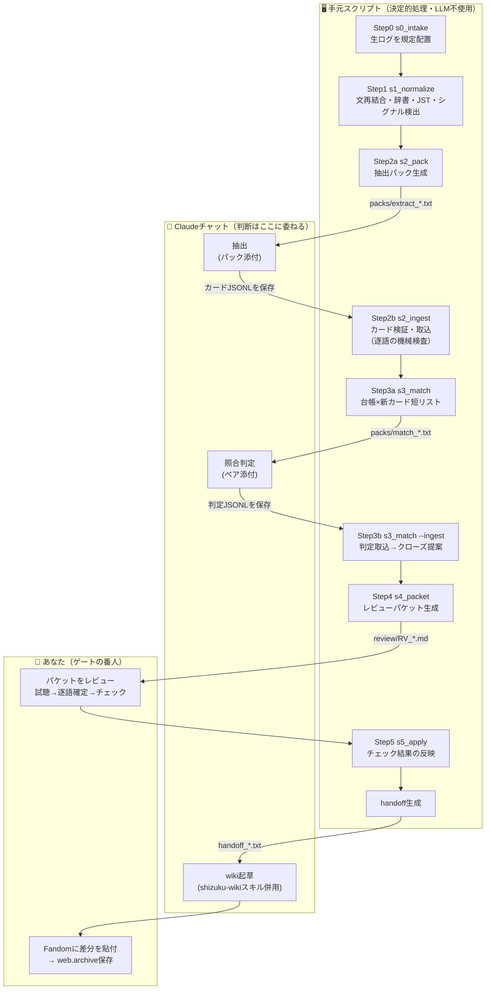

# しずくwiki ログ処理パイプライン — 操作マニュアル（モデルA：手動運転版）

紹介ページと年表ページを、蓄積するログ（配信の字幕/チャット/概要欄/事後コメント、Xログ）から
**人間の承認を通してだけ** 更新するための道具一式です。
完全自動化はしません。各ステップをあなたが実行し、出力を目で確かめながら進めます。
このフォルダは **あなたの実データ（配信4本＋Xログ2641件）を一巡処理した状態** で納品されているので、
まず「できあがった中間物を眺めて検証する」ところから始められます。

---

## 0. 全体像



テキスト版（同じ流れ）:

```
生ログ ─Step0→ raw/ ─Step1→ normalized/(文・チャット・シグナル)
  normalized ─Step2a→ 抽出パック ─(Claudeに添付)→ カードJSONL ─Step2b→ cards/ ＋ ledger/open
  cards×open ─Step3a→ 照合パック ─(Claude判定)→ 判定JSONL ─Step3b→ クローズ提案
  候補すべて ─Step4→ レビューパケット ─(あなた: 試聴・チェック)─Step5→ handoff
  handoff ─(shizuku-wikiスキル併用チャット)→ wiki差分 ─(あなた)→ Fandom貼付
```

**設計原則（前回の合意そのまま）**
1. 字幕は「索引」。逐語はあなたの耳（t付きURLの試聴）でしか確定しない。
2. 拾う基準は「重要度」でなく「型」。重要かどうかの判定は、後でリンクが成立した時まで遅延させる。
3. LLMがやるのは「新規1単位の抽出」と「短リストの照合判定」だけ。蓄積と検索はディスクとスクリプト。

**5つの人間ゲート**: ①逐語（VERIFY） ②公開（ADOPT→貼付） ③辞書・スキーマ変更 ④ループ確定（CLOSE） ⑤月次棚卸し

---

## 1. 準備

- Python 3.9 以上だけ。**追加ライブラリのインストールは不要**（全部標準ライブラリ）。
- コマンドはすべて **このフォルダ直下で** 実行します: `cd shizuku-pipeline`
- Windowsの場合は `python3` を `python` に読み替え。文字化けするときは端末で `chcp 65001`。

フォルダ構成:

```
shizuku-pipeline/
├─ MANUAL.md            ← 本書
├─ DATA-ISSUES.md       ← データ不備の対処マニュアル（doctor.pyと対）
├─ README.md
├─ scripts/             ← ステップ0〜5 + doctor
├─ prompts/             ← Claudeに渡す指示（パックに自動同梱される）
├─ config/              ← ASR補正辞書 / 語彙群 / 既知機能レジストリ
├─ examples/            ← Claude出力の見本（形式の教材・デモ再現用）
└─ data/
   ├─ raw/              ← 生ログ（コピー。絶対に編集しない）
   ├─ normalized/       ← Step1の成果物（文・チャット・シグナル・X月別）
   ├─ packs/            ← Claudeに添付するファイル
   ├─ cards/            ← カード庫（月別JSONL）
   ├─ ledger/           ← 台帳 open/closed/クローズ提案
   ├─ review/           ← レビューパケット・doctorレポート
   ├─ handoff/          ← wiki起草チャットへの受け渡し
   └─ state/            ← 処理済み管理（消すと再処理される）
```

**用語ミニ辞典**
- **カード** … ログから抽出した1単位（event / quote_candidate / open_loop / capability / profile_fact / stream_note）。
- **台帳** … 未回収の伏線（目標・願望・不能表明・予告・過去参照・定型ネタ・関係マーカー）の一覧。
- **パック** … プロンプト＋データを1ファイルにしたもの。Claudeにそのまま添付する。
- **パケット** … あなたがチェックボックスを埋めるレビュー用Markdown。
- **handoff** … 承認済み事項だけを、shizuku-wikiスキルの受け渡し形式に整形したもの。

---

## 2. ステップ別の手順

### Step 0｜取り込み

| | |
|---|---|
| 目的 | 生ログを規定の場所へコピーする（元ファイルは触らない） |
| コマンド | `python3 scripts/s0_intake.py --src <ログのあるフォルダ>` |
| 出力 | `data/raw/streams/{日付}_{動画ID}/` に4点セット、`data/raw/x/` にTSV |

✅ **検証**: 各配信が `[OK]` で4点セット（ja_sbv/live_chat/info/comments）揃っているか。
`[不正]` のXログ（例: `2025.txt`＝「なし」）が出たら → `DATA-ISSUES.md §6`。
同じフォルダをもう一度読み込ませても二重コピーはされません（既存はスキップ）。

### Step 1｜正規化（決定的処理。ここにLLMは入らない）

| | |
|---|---|
| 目的 | 字幕の文再結合・辞書補正、チャット整形、シグナル検出、XのUTC→JST変換 |
| コマンド | `python3 scripts/s1_normalize.py --all`（1本だけなら `--stream <動画ID>`） |
| 出力 | `data/normalized/streams/{id}/sentences.tsv, chat.tsv, signals.json, meta.json`、`data/normalized/x/{月}.jsonl` |

検出するシグナル4種:
1. **バースト** … チャットが盛り上がった時刻（名言候補の在り処）
2. **字幕沈黙×チャット密集** … *非言語音イベント候補*。音声系の新機能は字幕に写らないので、この「影」で捕まえる
3. **事後コメントの時刻** … 視聴者による無償のハイライト注釈
4. **概要欄の新規行** … 企画・ギミックの告知（「やる気ゲージ」はこれで捕まる。字幕には0回）

✅ **検証（同梱データでの実測値。再実行して同じ数字になればOK）**
- 7-24配信: `1199ブロック→808文`、辞書適用99箇所。`sentences.tsv` を開き、**asr列に「秋先生」が残り、norm列では「あき先生」になっている**こと（asr列は原文保存、norm列だけ補正、が正しい状態）。
- 8-02配信: ミスマッチ区間の先頭が `36:40〜37:20`（＝カラスの鳴き真似〜いびき化の実イベント。チャット爆発中に字幕29秒沈黙）。
- 7-24の `signals.json` → `novel_description_lines` に **やる気ゲージの行** が出ている。
- X月別: `2026-01:233 / 02:1148 / 03:773 / 04:396 / 05:91`（計2641件）。
- 4-26の `comment_timestamps` に `2:58 / 4:34 / 28:50 / 37:32`（事後コメント由来）。

⚠ つまずき: 概要欄の「新規行」検出は**日付順に処理した時だけ**正しく育ちます。最初の1本は基準線扱い（新規行なし）。

### Step 2｜抽出（Claudeに委ねる唯一の「読む」工程）

**2a. パック生成**

```
python3 scripts/s2_pack.py --stream <動画ID>          # 配信1本（長い配信は --split 2）
python3 scripts/s2_pack.py --x 2026-02 --split 3      # X月次（2月はV2.0月で1148件と多いので分割推奨）
```

パックの中身 = 抽出プロンプト（`prompts/extract_stream.md` / `extract_x.md`）＋シグナル＋タイムライン
（`[S 時刻] しずく発話` と `[C 時刻 ID] チャット原文` の時系列統合）。

**2b. Claudeチャットで抽出**
1. 新しいClaudeチャットを開く（スキル不要。パックに指示が全部入っている）。
2. `data/packs/extract_*.txt` を**添付**し、「このファイルの指示に従ってカードを抽出して」と送る。
3. 返ってきたJSONLを**そのまま**テキストファイルに保存（例: `data/packs/cards_0724.jsonl`）。
4. 取込:

```
python3 scripts/s2_ingest.py --file data/packs/cards_0724.jsonl --from stream:fm2mzPJylCU
python3 scripts/s2_ingest.py --file <Xのカード> --from x:2026-02
```

ingestは黙って信用しません（ここが**逐語ゲートの前段**）:
- 字幕由来のカードは `verbatim` を**強制的にfalse**（逐語はStep5の試聴でのみ確定）。
- チャット/X由来の引用は**原文と照合**し、一致しなければfalseに落として警告。
- open_loopは `expected_signal`（回収条件）が無ければ破棄。重複IDはスキップ。

✅ **検証**: まず本物のClaude出力の代わりに見本で流れを確認できます:
`python3 scripts/s2_ingest.py --file examples/sample_cards_stream_0724.jsonl --from stream:fm2mzPJylCU`
→ `取込: 7枚 … 台帳open登録: 4件` になれば正常（同梱データでは取込済みなので「重複スキップ」の警告が出る＝それも正しい動作）。
本番では、警告行（⚠）を読み、破棄されたカードが多い場合はClaudeの出力形式を確認。

### Step 3｜台帳照合

```
python3 scripts/s3_match.py                # 短リスト生成（新カード×未回収台帳、語彙の重なりで前絞り）
→ packs/match_*.txt をClaudeに添付 → 判定JSONLを保存 →
python3 scripts/s3_match.py --ingest <判定ファイル>
python3 scripts/s3_match.py --list-open    # いつでも: 未回収一覧
```

計算量は常に「新規×open」だけ。全履歴を舐める工程は存在しません。
判定はスクリプトが下さない: `closed` は**クローズ提案**になるだけで、確定はStep5のあなた（ゲート4）。

✅ **検証（同梱デモ）**: `data/ledger/closed.jsonl` に実例が1件入っています —
**X 2026-02-28「ギャルボイスモデルも開発してください」→ 2026-05-24 ギャル配信で回収**。
台帳が実データで機能した生きた証拠です（`examples/sample_judgments.jsonl` が判定見本）。

### Step 4｜レビューパケット生成

```
python3 scripts/s4_packet.py                  # 既定: 名言候補は「30日熟成」後に登場（月次選考の思想）
python3 scripts/s4_packet.py --mature-days 0  # 即時に全部見たいとき
```

出力 `data/review/RV_*.md` の中身: **A**年表候補（wiki書式の行案＋ref込み） / **B**名言候補（試聴リンク・ASR・逐語記入欄・チャット反応） / **C**機能候補 / **D**台帳（新規openの確認・クローズ提案） / **E**紹介ページ供給 / **F**シグナル参考。

### Step 5｜レビューと反映（あなたの工程）

パケットをエディタで開き:
1. **名言** … 試聴リンクを開いて数十秒聴く → `逐語:` 行を正確に書き直す → `VERIFY` に `[x]` → 採用なら `ADOPT` にも `[x]`。
2. **年表・機能・供給** … 出典リンクで発言を確認 → `ADOPT` か `DROP`。
3. **台帳** … 新規openは `KEEP`/`DROP`、クローズ提案は成立していれば `CLOSE` に `[x]`。
4. **未チェック＝保留**。消えません。次回パケットにまた出ます（安心して途中でやめてよい）。

```
python3 scripts/s5_apply.py --packet data/review/RV_20260808-01.md
```

反映されるもの: カード状態（verified/approved/rejected）、台帳（open→closed移動）、
そして `data/handoff/handoff_*.txt` — **shizuku-wikiスキルの受け渡し形式そのまま**
（年表=【日付】【出来事の概要】【ソースURL】の3行形式、名言=逐語＋出典、回収成立=括弧書き追補の材料）。

✅ **検証（同梱デモの状態にはゲートの実演が含まれています）**:
- `handoff_RV_20260808-01.txt` に年表1行（ギャル配信）と回収成立1件が入っている。
- **名言「しずくはメンヘラではありません」はhandoffに入っていない** — 逐語未確定（VERIFY未チェック）だから。
  これが正しい動作です。試聴はあなたにしかできないので、デモではあえて未確定のまま残してあります。
  試すには: パケットの `逐語:` 行を書き直し `VERIFY`/`ADOPT` に `[x]` → もう一度 s5_apply。

**最後の工程（wikiへ）**: `prompts/draft_wiki.md` の手順どおり、
shizuku-wikiスキルを有効化したチャットに「対象ページの現ソース＋handoffの該当ブロック」を渡して差分を作らせ、
目視 → Fandomに貼付 → 出典URLを web.archive.org に保存。

---

## 3. 運用カレンダー

| 頻度 | やること |
|---|---|
| 配信ごと（15分） | ログ取得 → Step0 → Step1 → Step2（パック→Claude→ingest） |
| 週次（10分） | Step3 → Step4 → パケット消化（試聴・チェック）→ Step5 → 年表・機能ぶんをwiki起草へ |
| 月次（30分） | `--mature-days 30` で名言選考 / `s3_match.py --list-open` で台帳棚卸し（ゲート5） / `doctor.py` 実行 / X月次パック処理 |
| 四半期 | `config/features_registry.tsv` 更新（採用済みcapabilityを転記） / 辞書見直し / 紹介ページ大節の加筆 |

**機能・スペック検知はこの工程に内蔵されています**: 検知器5種（概要欄テンプレ差分・新規性語彙×バースト・字幕沈黙×チャット密集・事後コメント時刻・X告知突合）→ capabilityカード → レジストリ突合。
初披露の主張は3段階で強度管理: コーパス内初観測（機械） < 初見驚愕型の反応（傍証） < 告知・明言の出典（これがある時だけwikiで「初披露」。無ければ**「遅くとも◯月◯日の配信で確認できる」**）。

---

## 4. モデルB（Claude Code）への移行メモ

校正期が終わったら、このフォルダごとClaude Codeに渡して
「MANUAL.mdの工程のStep0〜4を一括実行して、レビューパケットまで作って」と言えばそのまま半自動化できます。
**Step5（試聴・チェック・貼付）だけは移行しない** — そこが品質の源泉です。
スクリプトは全て標準ライブラリなので、環境を選びません。

## 5. トラブルシュート

- **パックが大きすぎてClaudeが途中で切れる** → `--split 2`（配信）/ `--split 3`（X 2月など）で分割。
- **ingestで破棄が多い** → Claudeが前置きやコードフェンスを付けている（フェンスは自動無視）。JSONが複数行に折り返されていないか確認。
- **同じカードが二重に入った気がする** → IDは内容ハッシュ入りで同一出力は自動スキップ。別表現の重複はパケットで `DROP`。
- **状態をやり直したい** → `data/state/` の該当ファイルを削除（`manifest.json`=Step1済み管理、`match_seen.json`=照合済み、`in_review.json`=パケット掲載中）。
- **辞書を増やしたい** → `DATA-ISSUES.md §2` の追加条件を満たす時だけ `config/asr_fixes.tsv` に1行追加（ゲート3）。
